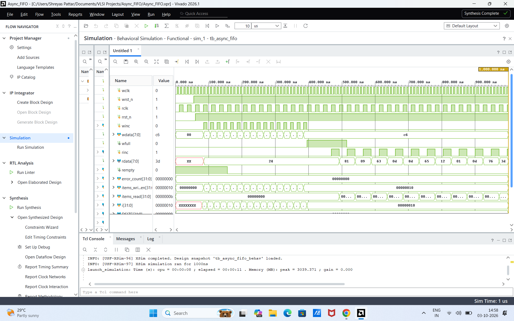

# Parameterized Asynchronous FIFO with Gray-Code CDC

A synthesizable, parameterized dual-clock asynchronous FIFO in Verilog (IEEE 1364-2001), verified with a self-checking SystemVerilog testbench and synthesized in Vivado for a Zynq-7000 device. Data crosses between unrelated write and read clocks using Gray-coded pointers and 2-flop synchronizers.

---

## Architecture

A raw binary counter cannot safely cross a clock boundary: if several bits change at once, the receiving clock can sample a value that never existed (e.g. `0111 -> 1000` captured as `1111`). Here each pointer is converted to Gray code, where consecutive values differ in exactly one bit, and then passed through a 2-flop synchronizer in the opposite clock domain. A pointer sampled mid-transition is at worst one count stale, never garbage.

```text
 WRITE DOMAIN (wclk)                                  READ DOMAIN (rclk)

 winc, wdata ──► ┌────────────┐                      ┌─────────────┐ ◄── rinc
                 │ wptr_full  │── wptr (Gray) ─────► │  sync_w2r   │
                 │            │                      │ (2-FF, rclk)│── rq2_wptr ──┐
 wfull ◄──────── │            │                      └─────────────┘              ▼
                 │            │                                            ┌─────────────┐
                 │            │ ┌─────────────┐                            │ rptr_empty  │ ──► rempty
                 │            │◄│  sync_r2w   │◄──────── rptr (Gray) ───── │             │
                 └─────┬──────┘ │ (2-FF, wclk)│                            └──────┬──────┘
                       │ waddr  └─────────────┘                                   │ raddr
                       ▼              wq2_rptr                                    ▼
                 ┌───────────────────────────────────────────────────────────────────┐
                 │  fifo_mem: dual-port array, write @ wclk, combinational read      │──► rdata
                 └───────────────────────────────────────────────────────────────────┘
```

### Modules

| File | Role |
|------|------|
| `async_fifo.v` | Top level. Connects the pointer logic, memory and both synchronizers |
| `fifo_mem.v` | Dual-port memory, `2^ASIZE` x `DSIZE` bits. Synchronous write (gated by `winc` and `!wfull`), combinational read |
| `sync_flop.v` | 2-stage flip-flop synchronizer for an `ASIZE+1`-bit pointer |
| `wptr_full.v` | Binary write counter, binary-to-Gray encoder, registered `wfull` |
| `rptr_empty.v` | Binary read counter, binary-to-Gray encoder, registered `rempty` |

### Parameters

| Parameter | Meaning | Default |
|-----------|---------|---------|
| `DSIZE` | Data width in bits | 8 |
| `ASIZE` | Address bits; depth = `2^ASIZE` | 4 (16 entries) |

### Ports

| Port | Dir | Domain | Description |
|------|-----|--------|-------------|
| `wclk`, `wrst_n` | in | write | Write clock, active-low async reset |
| `winc`, `wdata[DSIZE-1:0]` | in | write | Write enable and data |
| `wfull` | out | write | FIFO full |
| `rclk`, `rrst_n` | in | read | Read clock, active-low async reset |
| `rinc` | in | read | Read enable |
| `rdata[DSIZE-1:0]` | out | read | Read data (valid for the current read address when not empty) |
| `rempty` | out | read | FIFO empty (set during reset) |

---

## How the flags work

Pointers are `ASIZE+1` bits wide. The extra MSB tells "full" apart from "empty" when the lower address bits match. Let `N = ASIZE`.

**Binary to Gray:** `gray = bin ^ (bin >> 1)`

**Empty** (evaluated in `rclk`): the next read Gray pointer equals the synchronized write Gray pointer.

```verilog
rempty_val = (rgray_next == rq2_wptr);
```

**Full** (evaluated in `wclk`): the write pointer is exactly one lap ahead of the read pointer. In Gray code that means the top two bits are inverted and the remaining `N-1` bits match.

```verilog
wfull_val = (wgray_next == {~wq2_rptr[N:N-1], wq2_rptr[N-2:0]});
```

Both flags are computed from the next pointer value and registered, using a delayed copy of the opposite pointer. A flag may therefore assert slightly early or deassert slightly late, but it can never be wrong in the unsafe direction, so the FIFO cannot overflow or underflow. The cost is a few cycles of extra latency at the boundaries.

---

## Implementation results

Vivado, target `xc7z010clg400-1` (Zynq-7000, speed grade -1).

### Constraints

`constraints/constraints.xdc` defines the two clocks and declares them asynchronous:

| Clock | Frequency | Period |
|-------|-----------|--------|
| `wclk` | 100 MHz | 10.0 ns |
| `rclk` | 40 MHz | 25.0 ns |

```tcl
set_clock_groups -asynchronous -group [get_clocks wclk] -group [get_clocks rclk]
```

### Timing (post-synthesis)

| Metric | Value | Status |
|--------|-------|--------|
| Worst negative slack (setup) | +6.737 ns | Met |
| Worst hold slack | +0.092 ns | Met |
| Failing endpoints | 0 | Clean |

Note: because the clocks are declared asynchronous, the clock-domain crossings themselves are not timed by these numbers. They cover only the logic inside each domain.

### Utilization

| Resource | Available | Used | Utilization |
|----------|----------:|-----:|------------:|
| Slice LUTs | 17,600 | 28 | 0.16% |
| LUTRAM | 6,000 | 8 | 0.13% |
| Slice registers | 35,200 | 40 | 0.11% |
| Bonded IOBs | 100 | 24 | 24.00% |
| BUFG | 32 | 2 | 6.25% |

---

## Verification

`tb/tb_async_fifo.sv` instantiates the FIFO with the default 16 x 8 configuration and runs `wclk` at 100 MHz against an unrelated `rclk` of about 41.7 MHz (24 ns period). Every word read is compared against a SystemVerilog queue that acts as a golden model.

| Test | What it does |
|------|--------------|
| 1. Fill | Writes 16 words, then checks that `wfull` is asserted |
| 2. Write while full | Attempts one more write once the FIFO is full |
| 3. Drain | Reads until `rempty`, checking each word against the queue, then checks `rempty` is asserted |
| 4. Concurrent | 40 write slots and 60 read slots with random enables running in parallel on the two clocks, followed by a final drain |

The testbench keeps its own read/write counts and an error counter and prints a pass/fail summary:

```text
==============================================
              SIMULATION SUMMARY
==============================================
 Total Items Written : 36
 Total Items Read    : 36
 Total Errors Found  : 0
 STATUS: >>> ALL TESTS PASSED SUCCESSFULLY <<<
==============================================
```

### Waveform



The capture above shows the first 1 us of the run:

- `rempty` stays high after reset and drops a few `rclk` cycles after the first write, reflecting synchronizer latency.
- `wfull` asserts once the 16th word is written (around 400 ns) and drops again when reads begin.
- Reads return data in the order it was written and `error_count` stays at 0.

### Not covered yet

- The testbench only issues `winc` when `wfull` is low and `rinc` when `rempty` is low, so the FIFO's own overflow and underflow guards are not exercised.
- Single fixed clock ratio and a single run (no seed or ratio sweep).
- No reset-during-operation test.
- No formal checks and no gate-level or timing simulation.

---

## Known limitations

- **Resets are not synchronized.** `wrst_n` and `rrst_n` are used directly as asynchronous resets. Deasserting each reset synchronously to its own clock is the expected practice for real designs.
- **Constraints only declare the clocks asynchronous.** There is no `ASYNC_REG` attribute on the synchronizer flops and no max-delay or bus-skew constraint on the Gray pointer paths, so the tool is not told to keep the two sync flops together or to bound pointer skew.
- `ASIZE` must be at least 2 (the full-flag expression uses `[ASIZE-2:0]`). Depth is always a power of two.
- `rdata` is a combinational read of the memory, which maps to distributed RAM on this device.

---

## Repository structure

```text
Async-FIFO-CDC/
├── rtl/
│   ├── async_fifo.v
│   ├── fifo_mem.v
│   ├── sync_flop.v
│   ├── wptr_full.v
│   └── rptr_empty.v
├── tb/
│   └── tb_async_fifo.sv
├── constraints/
│   └── constraints.xdc
├── waveform/
│   └── waveform_results.png
├── LICENSE
└── README.md
```

## Running it in Vivado

1. Create an RTL project for `xc7z010clg400-1` (or any 7-series part).
2. Add everything in `rtl/` as design sources with `async_fifo.v` as top.
3. Add `tb/tb_async_fifo.sv` as a simulation source (type SystemVerilog) and set it as the simulation top. Add `constraints/constraints.xdc` as constraints.
4. Run Behavioral Simulation, then `run all` in the Tcl console so it reaches `$finish` and prints the summary. (The default run time stops at 1 us.)
5. Run Synthesis, then `report_timing_summary` for slack and `report_cdc` for the crossing report.

## License

MIT. See [LICENSE](LICENSE).
